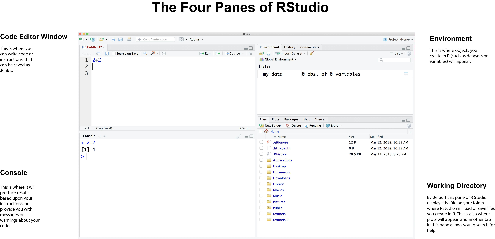

 
**Chris Bail, PhD**  
**Duke University**  
[www.chrisbail.net](http://www.chrisbail.net)  
[github.com/cbail](https://github.com/cbail)  
[twitter.com/chris_bail](https://twitter.com/chris_bail)  
  

# Introduction

This tutorial is part of a broader series designed to introduce those with little or no programming background to the field of computational social science. 

In this course we are going to use the R software. R is one of the two most widely-employed software languages in the field of data science, and it is very widely used within academia (especially among social scientists and statisticans). R is also completely free and has an enormous range of capabilities: from stunning interactive visualizations to state-of-the-art statistical analyses and even the capacity to build apps or web pages. In this course we will only scratch the surface of R's capabilities, but my goal is to get you to the place where you can eventually acquire new information about how to use R on your own. 

# Getting Started

In order to use R, we are going to use a program called RStudio. In order to use Rstudio, however, you must also install R itself. 

# How do I install R?

To offer a somewhat imperfect analogy, the R software is the "brains" of R, and RStudio is its "face," or a Graphical user interface (GUI), that allows you---the user---to command R's brain. 

First, you need to download R here [this link](https://cran.r-project.org/mirrors.html). You will see a list of geographic locations from which you can download R. You can choose any of them, but download speeds will be fastest from the location that is closest to you.

You may install Rstudio via [this link](https://www.rstudio.com/products/rstudio/download/#download)---make sure to choose the version that is appropriate for your operating system (e.g. Mac/Windows/Linux). 

# Opening R for the first time

Many R users will seldom---if ever---use R without RStudio. Instead, most people now use R Studio as their main way of interacting with the R software. If you have successfully installed RStudio, you can click on the icon in your computer's application folder to open your first session. The figure below provides a very basic overview of what each pane or panel within R studio does.

   

At first, the multiple panes or windows of RStudio may seem a bit intimidating, so let's take a brief tour. As the picture above shows, there are four different panes. The one that appears in the top left is called the "Code Editor Window"-- this is where you type code or instructions into RStudio. The pane just below that is called the "Console"-- this is where most of the output of your code will appear. For example, in the picture above, the user has typed in 2+2 and the console is showing us the output of that code when it is run (4).

The upper-left hand pane in RStudio is called the "environment" pane. Here you will see any "objects" you have created in R. Objects can mean a lot of different things. For example, you might have a dataset loaded into R that could appear there. If you have used other statistics programs before such as SPSS or Stata this may seem strange: why do I need to see the dataset I have loaded already? The answer is that R users regularly work with multiple datasets (or other types of objects) at the same time-- and indeed, this is one of the great strengths of R.

Finally, the lower-right hand pane has a number of different features. Mostly, you will use it to browse your "working directory," which is the folder on your computer where R will either a) save data you generate in your R session; or b) look for data that you try to read into R from your computer. This lower-right hand pane is also where you will see visualizations you make in R, and has several other features as well. For example, you can use this pane to browse R's "help" files (though I encourage you to wait to do that until you have a better understanding of how to use them).

# Typing Your First Line of Code

Now that you have a very basic familiarity with R, try typing your first line of code: write 2+2 in the code editor window, then click the "run" button in the top right corner of the pane (it has a green arrow next to it). You should see the output of your code in the console, as in the picture above. 

# Keeping An Open Mind

Learning any new software language can be very challenging. It can be particularly challenging when you are learning an open-source software such as R. This is because R is not built by a company that succeeds based upon the ease in which users can use their tools, but rather a diverse, vibrant community of volunteers who try to make R easier to use. Though these volunteers are truly extraordinary and selfless-- and have made great strides towards making R easier to learn and use-- it is impossible for them to dedicate the amount of time necessary to develop full user support, or keep apace with the remarkable pace of innovation in R. 

Another reason why it is hard to teach the basics of R is that there are so many different ways of doing the same thing in R. This is because different groups of people who built R over the years developed different types of solutions to common problems that people who use R face. In this course, we are going to try to streamline some of this by using something called the Tidyverse. This is a collection of people who have built "packages" (add on features to R that we will install in later tutorials) in order to make R easier to use. In fact, many of the people who support the Tidyverse are also the people who built RStudio!

