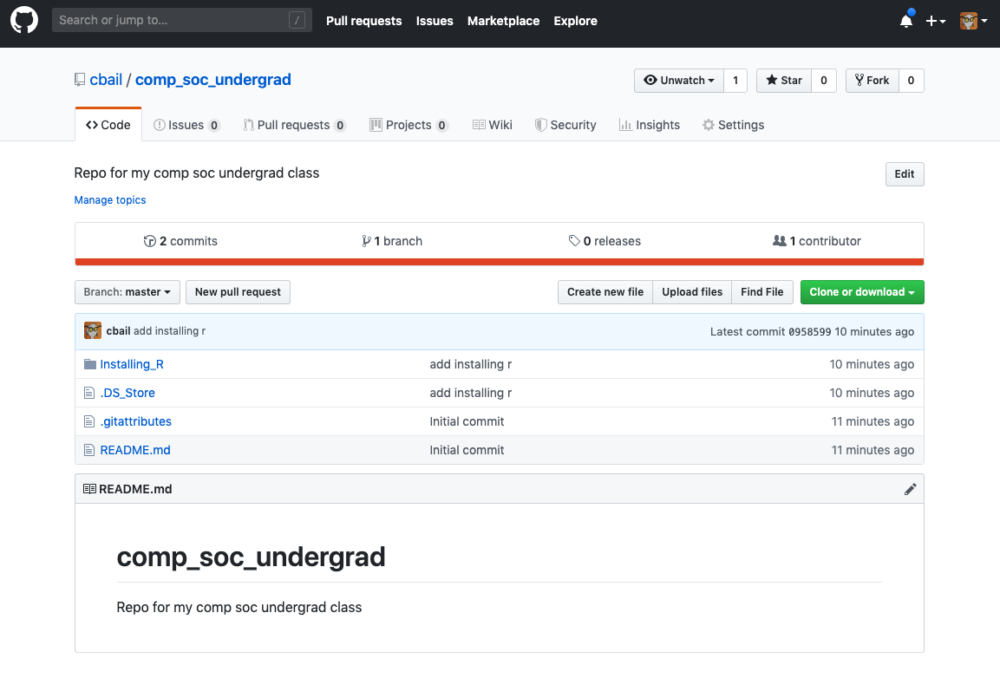
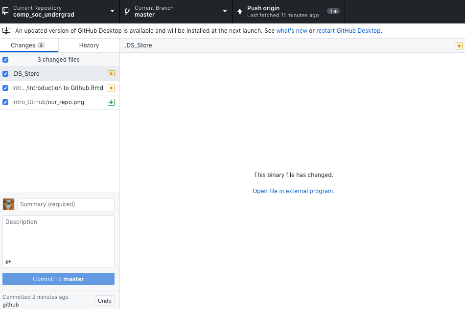

 
**Chris Bail, PhD**  
**Duke University**  
[www.chrisbail.net](http://www.chrisbail.net)  
[github.com/cbail](https://github.com/cbail)  
[twitter.com/chris_bail](https://twitter.com/chris_bail)  
  

# Introduction

This tutorial is part of a broader series designed to introduce those with little or no programming background to the field of computational social science. 

In this course we are going to use Github to access course materials and-- eventually-- to code together as part of a group research project. Github is a site that allows people who code to share code with each other, and create code together. At its core, Github is a tool that allows one to both download someone else's code in a very efficient manner as well as edit that code and "push" or upload it back up to the Github "repository" or folder where the code lives.

Another critical feature of Github-- which will be difficult to appreciate until we get further along in the class-- is that it allows us to "time travel" through our code. We can both a) "Fork" some code (meaning take some else's code and tweak it for our own purposes); and also b) go back in time and restore previous versions of our code if we make errors (not unlike restoring a previous version of a Dropbox folder, if you are familiar with Dropbox). Because we may struggle to find exactly where we want to fork or restore code, every time we change a file on Github we make what is called a "commit" or a change that we upload to a file in a repository. To keep track of these commits, we often add some text each time we make a change that describes what we are changing.

# Getting Started

In order to get a feel for Github, we are going to begin by installing Github Desktop, which is a tool for using Github on your computer. You can install Github Desktop by [clicking here](https://desktop.github.com/). This link should automatically detect your computer's operating system and recommend the best version.

Once you click download, you must wait for the file download, and then click on it to start the installation process. At some point in this process, you will be asked to enter your Github user name and password. Hopefully, you have already created a Github account as I recommended you do on the first day of class. If not, you will need to do this now.

# Cloning your first "Repo"

The very first thing we are going to do in this class is clone the repository or "repo" where our class materials live. This repository is called "comp_soc_undergrad" (a  name I selected to reflect the content and level of this class). To do this, you first need to find the repository online. Here is a [link](https://github.com/cbail/comp_soc_undergrad) to our class repo.

Once you click that link you should see something that looks like this: 

   

Once you see the image above, click on the green "Clone or Download" button and then choose "Open in Desktop." This should then prompt your computer to launch a dialogue to ask whether you want to launch Github Desktop (you do). If you have successfully cloned the repo, it should look something like this:

   

Let's take a minute to explore the image above. First, take note of the "current repository" drop down menu in the upper left hand corner of your window. You should only see the name of our repo, unless you created your own repo or have used Github before this class. Next, you'll see a description of the "Current Branch"-- this is essentially a way of keeping track of different versions of the software. Finally, you'll see something about "pushing origin" or "fetching origin." Fetching means downloading the most reason version of the repo to your desktop, and pushing means changing the repo yourself. 

At this point, you can ignore fetching and pushing AND committing files to our repo. For now all I want you to learn how to do is to access the files that we will edit together in class. 

# Finding a file on our Repo

When you install Github onto your computer, you are actually creating a folder on your computer. Every time you edit something in that folder, you will be slightly changing a file on the repo. This let's you work on a file on your machine and then eventually share it with others (or, benefit instantaneously from the edits of other people with whom you are working together on some code).

Take a minute and try to find the location of the Github folder on your computer. If you are on a Mac, the default location should be your "Documents" folder in your home directory. If you are on a Windows machine, the default location should be in a similar location.

The file I would like you find and open for the next section of our class is called "Installing-R-Tutorial.html"

